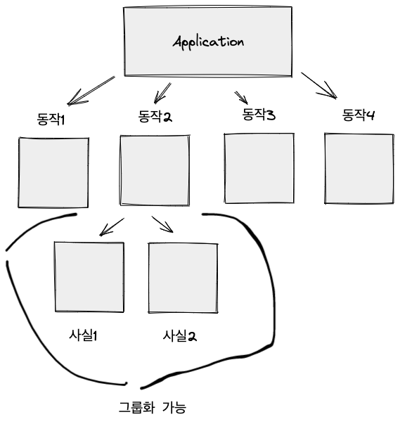

# 단위 테스트 구조 (Review)

## 단위 테스트를 작성할 때 지켜야 할 구조 

일반적으로 테스트를 작성한다고 하면 AAA (준비 - 실행 - 검증) 구조를 따른다. 

- 이 패턴은 Given - When - Then 과 같다. 이렇게 알고 있는 사람이 더 많을수도. 

이 구조의 장점은 모든 테스트가 일관된 규칙을 가질 수 있는 점과 준비 -> 실행 -> 검증으로 가면서 테스트를 이해하기 더 쉽다는 점이 있다. 

이 구조로 할 때 주의할 점이 있다. 

- 딱 한 개의 검증문을 가질 필요는 없다. 테스트는 하나의 동작 이후에 검증을 하는 것이다. 검증할 게 딱 하나만 있지는 않을 것. 꼭 테스트 당 하나의 검증문을 가질 필요는 없다. 다만 같은 속성을 검증하는 것이라면 클래스로 뺴내서 검증하면 코드를 좀 더 줄일 수 있을 것. 

- 여러개의 준비, 실행, 검증문을 가진다면 테스트를 이해하는데 복잡할 수 있다. 하나의 테스트에는 하나의 실행과 하나의 검증문을 가지도록 하는게 가독성 면에서 더 좋다. 

- 준비 구절이 너무 크다면 이를 팩토리 클래스나 메소드로 빼내는게 더 가독성 면에서 좋을 수 있다. 데이터를 생성하는 측면에서는 빌더가 나을 수도 있다. 

- 실행 절이 한 줄보다 많다면 API 설계의 문제일 수 있다. 캡슐화를 하는게 나아보일 수 있다. 

- 준비 - 실행 - 검증 이렇게 세 부분을 주석으로 남겨두면 더 알기 쉬울 수 있다. 물론 빈 줄로 분리할 수도 있다. 

## 테스트에서 지켜져야 할 사항

테스트간에는 서로 결합이 없도록 해야한다. 결합도가 높으면 안티패턴이다. 

테스트는 어떠한 검증을 하는지 가독성이 좋아야한다.

## 테스트 픽스처 팁

(테스트 픽스처는 테스트 할 대상을 말한다.)

일반적으로 테스트 픽스처는 코드의 중복을 만들 수 있으므로 별도의 팩토리 클래스, 메소드로 빼내서 하는게 더 가독성이 좋다. 

생성자로 만들어서 초기화 하는 방법도 있는데 그러면 테스트만 보고 어떠한 일을 하는지 알기 어렵다. 생성자와 테스트 왔다갔다 봐야 파악이 가능하다. 

이렇게 하기 보다는 테스트만 보고 알 수 있도록 해야한다. 

예외로 데이터베이스와 같은 통합 테스트를 위해서 테스트 픽스처를 사용하는 경우에는 생성자를 사용하는게 한 번의 초기화만 하면 되므로 합리적인데 이 같은 경우에는 추상 클래스와 상속을 이용하면 편하다.  

```java 
public class CustomerTest extends IntegartionTest {
    
    @Test
    void purchase_succeeds_when_enough_inventory() {
        ...
        // database 사용.
    }
}
```

````java
public abstract class IntegrationTest {
    protected final Database database; 
    
    protected IntegrationTest() {
        database = new Database(); 
    }
}
````

## 테스트 명명법

일반적으로 사람은 이야기 기반의 설명을 더 이해하기 쉬워한다.

그러므로 시나리오 기반으로 작성을 하면 좋을 것 같고 비개발자나 도메인 전문가가 봐도 이해할만한 검증을 이름으로 쓰도록 하자.

일반적으로 이름을 작성할 때 스네이크 케이스 (= `_`) 로 단어를 구별하면 읽기가 쉽다. (카멜케이스는 짧은 단어에만 효과적인듯)  

그리고 테스트 이름을 작성할 땐 소망, 바램 이런게 들어가면 안된다. 단호하게 결론이 나야하는 이름을 지어야한다. 


## 테스트 묶기 



비슷한 종류의 테스트라면, Input 만 조금 다른 테스트라면 하나의 테스트로 추상화해서 묶는게 더 코드를 줄이고 유지보수하는데 좋을 수 있다. 

다음과 같이. 

```c#
public class DeliveryServiceTests {
    
    [InlineData(-1, false)]
    [InlineData(0, false)]
    [InlineData(1, false)]
    [InlineData(2, true)]
    [Theory] 
    public void can_detect_an_invalid_delivery_date (int daysFromNow, bool expected) {
        ...
    }
}
```

- 여기서 InlineDate 가 테스트에 실행되는 데이터를 전달해준다. 
- 물론 이렇게 추상화를 하면 그 만큼 더 테스트가 이해하기 어려워 질수도 있다. 이 경우에는 테스트 검증을 긍정, 부정으로는 나누는 식으로 하는 방법도 있다. 적절하게 사용하자. 