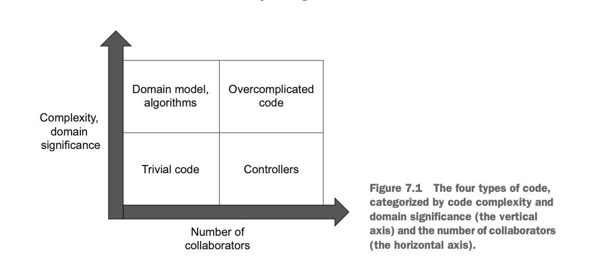
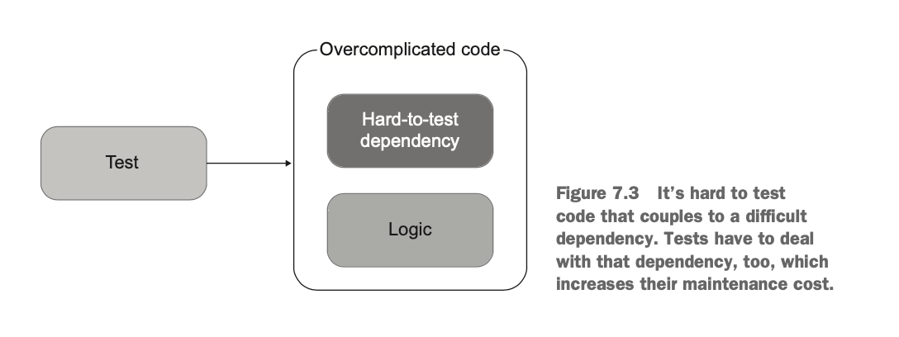
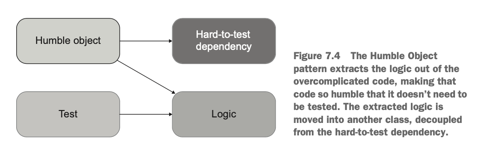

# 가치 있는 단위 테스트를 위한 리팩터링 

이전 장들에서 가치 있는 테스트를 식별하기 위한 요소들을 알아봤다.

- 회귀 방지

- 리팩터링 내성

- 빠른 피드백

- 유지보수성

여기서는 가치 있는 테스트를 작성하기 위항 코드 설계법을 알아본다. 제품 코드와 테스트 코드 사이에는 관련성이 많으므로. 

## 테스트 할 코드 식별하기

코드의 복잡도와 도메인 유의성 그리고 협력자 수를 기반으로 코드는 다음과 같이 4 가지로 나뉜다.

그림으로 나누면 다음과 같다. 



- **도메인 모듈과 알고리즘:** 도메인 모듈과 복잡한 코드는 회귀 방지를 위해서 테스트틀 꼭 해야한다. 

- **간단한 코드**: 간단한 코드는 테스트 할 가치가 없다. 

- **컨트롤러 (서비스)**: 컨트롤러 레벨의 테스는 통합 테스트로서 가치가 있다. 

- **지나치게 복잡한 코드**: 문제는 이 부분인데 테스트 할 가치는 충분하지만 테스트 하기 어렵다. 이 부분의 해결은 쪼개서 도메인 모듈과 컨트롤러노 나누도록 해야한다. 

### 험블 객체 패턴을 통해서 지나치게 복잡한 코드 분할하기 

지나치게 복잡한 코드를 쪼개기 위해서는 험블 객체 패턴 (Humble Object Pattern) 을 쓰면 된다. 

복잡한 코드는 다음과 같이 테스트하기 어려운 의존성들과 핵심 로직을 같이 가지고 있다. 



이 코드를 앞 단에 험블 객체를 둬서 의존성과 핵심 로직을 분리한다. 



그래서 테스트는 로직에만 집중해서 설계하면 된다. (지나치게 복잡한 코드 -> 도메인 모델의 테스트로 이동)

그리고 험블 객체의 테스트는 컨트롤러 레벨로 이동시키면 된다. (지나치게 복잡한 코드 -> 컨트롤러 테스트로 이동)

정리하자면 험블 객체 패턴은 비즈니스 로직과 오케스트레이션 (orchestration 으로 복잡한 의존성을 말함.) 을 분리하는 패턴을 말한다. 

이렇게하면 복잡한 의존성을 분리시킬 수 있어서 테스트에 용이하고 비즈니스 로직에만 집중할 수 있어서 코드의 복잡도를 줄일 수 있다.

이 패턴은 도메인 주도 설계 (Domain-Driven-Design) 의 Aggregate Pattern 과도 유사점이 있다. 

- Aggregate Pattern 은 클래스를 클러스터로 묶어서 클러스터 안의 클래스는 서로 긴밀하게 관련이 있지만 클러스터 끼리의 결합은 느슨하게 필요한 결합만 하도록 한다. 

## 실제 예제로 보자. 

여기서는 지나치게 복잡한 코드를 알고리즘과 컨트롤러로 나누는 종합 예제를 살펴보자. 

예제 프로젝트는 사용자 등록을 처리하는 고객 관리 시스템 (CRM, Customer Management System) 이며 모든 사용자가 데이터베이스에 저장된다.

이 연산에는 세 가지 비즈니스 규칙이 있다. 

- 사용자 이메일이 회사 도메인에 속한 경우 해당 사용자는 직원으로 표시된다. 그렇지 않으면 고객으로 간주한다.

- 시스템은 회사의 직원 수를 추적해야 한다. 사용자 유형이 직원에서 고객으로, 또는 그 반대로 변경되면 이 숫자도 변경해야 한다. 

- 이메일이 변경되면 시스템은 메시지 버스로 메시지를 보내 외부 시스템에 알려야 한다. 

다음은 CRM 시스템의 초기 구현이다.

```csharp
public class User
{
    public int UserId { get; private set; }
    public string Email { get; private set; }
    public UserType Type { get; private set; }
    
    public void ChangeEmail(int userId, string newEmail)
    {
        object[] data = Database.GetUserById(userId);
        UserId = userId;
        Email = (string)data[1];
        Type = (UserType)data[2];
        if (Email == newEmail)
            return;
        object[] companyData = Database.GetCompany();
    
        string companyDomainName = (string)companyData[0];
        int numberOfEmployees = (int)companyData[1];
        
        string emailDomain = newEmail.Split('@')[1];
        bool isEmailCorporate = emailDomain == companyDomainName;
        UserType newType = isEmailCorporate
            ? UserType.Employee
            : UserType.Customer;
        
        if (Type != newType)
        {
            int delta = newType == UserType.Employee ? 1 : -1;
            int newNumber = numberOfEmployees + delta;
            Database.SaveCompany(newNumber);
        }
        
        Email = newEmail;
        Type = newType;
        
        Database.SaveUser(this);
        MessageBus.SendEmailChangedMessage(UserId, newEmail);
    }
} 

public enum UserType
{
    Customer = 1,
    Employee = 2 
}
```

- 이 코드는 도메인 영역의 코드이다. 

- 문제점은 도메인 코드인데 프로세스 외부 협력자와 결합되어 있다는 측면이다. (이런 코드는 확장성 측면에서 점수가 낮다.)

- 따라서 이 코드는 지나치게 복잡한 코드에 속한다. 

이 코드를 한단계씩 개선해보자. 

### 1단계: 암시적 의존성을 명시적 의존성으로 바꾸자.

암시적 의존성은 실제 객체의 내부를 봐야 알 수 있는 의존성으로 생성자에서 의존성을 받지 않는 걸 말한다. 

이런 의존성은 대체하기가 어려우므로 테스트하기 어렵다. 

그래서 암시적 의존성은 명시적 의존성으로 바꾸는게 좋다.

### 2단계: 애플리케이션 서비스 계층 도입 

도메인 모델이 외부 시스템과 통신하는 문제를 극복하려면 다른 클래스인 험블 컨트롤러 (Humble Controller) 를 만들고 거기로 책임을 옮기면 된다. 

```csharp
public class UserController
{
    private readonly Database _database = new Database();
    private readonly MessageBus _messageBus = new MessageBus();

    public void ChangeEmail(int userId, string newEmail)
    {
        object[] data = _database.GetUserById(userId);
        string email = (string)data[1];
        UserType type = (UserType)data[2];
        var user = new User(userId, email, type);

        object[] companyData = _database.GetCompany();
        string companyDomainName = (string)companyData[0];
        int numberOfEmployees = (int)companyData[1];
        
        int newNumberOfEmployees = user.ChangeEmail(
            newEmail, companyDomainName, numberOfEmployees);
        
        _database.SaveCompany(newNumberOfEmployees);
        _database.SaveUser(user);
        _messageBus.SendEmailChangedMessage(userId, newEmail);
    }
}
```

- 많이 개선되긴 했지만 이 코드에도 여전히 문제가 잇다.

- 컨트롤러는 외부 의존성과 도메인 객체의 연결을 담당하는 오케스트레이션 역할을 주로 해야한다. 

- 즉 심플해야하며 도메인 코드를 가지고 있으면 안된다. 여기서는 데이터베이스에서 조회한 데이터를 바탕으로 객체를 생성하므로 코드가 다소 복잡하다.

- 그리고 컨트롤러는 새로운 이메일이 예전과 달라졌는지 확인하지 않고 무조건 메시지 버스를 통해서 알림을 보낸다. 

- 이 문제를 해결하기 위해서 여기서는 ORM 을 쓰면 객체의 생성과 관련한 부분 코드를 줄일 수 있으므로 좋을 수 있다. ORM 을 못쓴다면 팩토리 클래스를 만들어서 거기서 책임을 담당해 로직을 단순화 할 수도 있다. 

반면 User 클래스는 이제 의존성을 걷어냈으니 테스트 하기가 쉬워졌다. 


```csharp
public int ChangeEmail(string newEmail,
    string companyDomainName, int numberOfEmployees)
{
    if (Email == newEmail)
        return numberOfEmployees;
    
    string emailDomain = newEmail.Split('@')[1];
    bool isEmailCorporate = emailDomain == companyDomainName;
    UserType newType = isEmailCorporate
        ? UserType.Employee
        : UserType.Customer;
    
    if (Type != newType)
    {
        int delta = newType == UserType.Employee ? 1 : -1;
        int newNumber = numberOfEmployees + delta;
        numberOfEmployees = newNumber;
    }
    
    Email = newEmail;
    Type = newType;
    return numberOfEmployees;
}
```

### 3단계: 어플리케이션 서비스 복잡도 낮추기

컨트롤러 클래스의 복잡도를 낮추기 위해서 객체의 생성을 팩토리 클래스에 위임하도록 변경하자. 

이를 통해서 도메인 코드를 격리시킬 수 있고 컨트롤러 레벨의 코드는 조금 더 단순해진다. 

### 4단계: Company 클래스 도입 

회사로직과 관련된 부분의 책임을 가지는 도메인 클래스인 Company 를 도입하면 추상화 시킬 수 있고 변경에 더 강해진다. 

여기까지 리팩터링을 하고 난 후의 코드는 정리하면 다음과 같다.

```csharp
 public class UserFactory
{
    public static User Create(object[] data)
    {
        Precondition.Requires(data.Length >= 3);
        int id = (int)data[0];
        string email = (string)data[1];
        UserType type = (UserType)data[2];
        return new User(id, email, type);
    }
}

public class Company
{
    public string DomainName { get; private set; }
    public int NumberOfEmployees { get; private set; }
    
    public void ChangeNumberOfEmployees(int delta)
    {
        Precondition.Requires(NumberOfEmployees + delta >= 0);
        NumberOfEmployees += delta;
    }
    
    public bool IsEmailCorporate(string email)
    {
        string emailDomain = email.Split('@')[1];
        return emailDomain == DomainName;
    }
}

public class UserController
{
    private readonly Database _database = new Database();
    private readonly MessageBus _messageBus = new MessageBus();
    public void ChangeEmail(int userId, string newEmail)
    {
        object[] userData = _database.GetUserById(userId);
        User user = UserFactory.Create(userData);
        
        object[] companyData = _database.GetCompany();
        Company company = CompanyFactory.Create(companyData);
        
        user.ChangeEmail(newEmail, company);
        
        _database.SaveCompany(company);
        _database.SaveUser(user);
        _messageBus.SendEmailChangedMessage(userId, newEmail);       
    }
}
```

## 컨트롤러의 로직 처리 

기존까지 리팩터링 한 컨트롤러는 로직이 단순하다. 

- 저장소에서 데이터 조회 

- 비즈니스 로직 실행 

- 데이터 저장 

근데 모든 컨트롤러가 이렇게 단순화된 구조로 가게 된다면 불필요한 데이터를 조회한다던지, 불필요한 호출을 한다던지 등의 성능상의 이슈가 생길 수 있다. 

이 문제를 해결하는 방법으로는 도메인 모델에 프로세스의 외부 의존성을 결합하던지, 아니면 컨트롤러의 의사결정을 좀 더 세분화 하던지 등의 처리를 할 수 있다. 

대부분 후자로 문제를 해결하는데 컨트롤러의 문제를 좀 더 단순화 시키는 방법으로 `CanExecute / Execute` 패턴을 사용하고 비즈니스 처리 후 도메인 이벤트를 알 수 있도록 하기 위해서 도메인 이벤트를 발행하는 방법을 사용한다. 

### CanExecute / Execute 패턴 사용 

컨트롤러 복잡도가 커지는 걸 완화하는 방법으로 `CanExecute/Execute` 패턴을 사용한다.

컨트롤러 로직에 비즈니스 로직이 추가되는 걸 완화해준다.

바로 샘플로 보자. 

요구사항 추가로 이메일은 사용자가 확인할 때까지만 변경할 수 있다고 하자. 

사용자가 확인한 후에 이메일을 변경하려고 하면 오류 메시지가 출력된다. 이 새로운 요구사항을 담고자 User 클랫에 `IsEmailConfirmed` 프로퍼티를 추가했다.

```csharp 
public class User
{
    public int UserId { get; private set; }
    public string Email { get; private set; }
    public UserType Type { get; private set; }
    public bool IsEmailConfirmed
        { get; private set; } 
}
```

이 검사를 User.changeEmail() 메소드 안에다가 넣을 수도 있고 컨트롤러 레벨에다가 넣을 수도 있다. 

```csharp
// User Class 
public string ChangeEmail(string newEmail, Company company)
{
    if (IsEmailConfirmed)
        return "Can't change a confirmed email";
    /* the rest of the method */
}
```

````csharp
// User Controller 
public string ChangeEmail(int userId, string newEmail) {
    object[] userData = _database.GetUserById(userId);
    User user = UserFactory.Create(userData);
    
    object[] companyData = _database.GetCompany();
    Company company = CompanyFactory.Create(companyData);
    
    string error = user.ChangeEmail(newEmail, company);
    if (error != null)
        return error;
    
    _database.SaveCompany(company);
    _database.SaveUser(user);
    _messageBus.SendEmailChangedMessage(userId, newEmail);
    return "OK";
}
````

도메인에 검사를 넣으면 불필요하게 메시지 버스에 이벤트를 발행해야 하므로 성능상의 이슈가 생기고 

컨트롤러 레벨에다가 넣으면 비즈니스 로직이 파편화 되며 캡슐화가 안되는 문제가 생긴다.

기존에 오케스트레이션과 비즈니스 로직을 분리하고자 하는 작업을 완료하지 못하게 된다. 

이 이슈를 해결하기 위해서 `CanExecute/Execute` 패턴을 사용하면 된다. 

```csharp
// User Class 
public string CanChangeEmail()
{
    if (IsEmailConfirmed)
        return "Can't change a confirmed email";
    return null;
}

public void ChangeEmail(string newEmail, Company company)
{
    Precondition.Requires(CanChangeEmail() == null);
    /* the rest of the method */
}
```

이렇게 한 후 컨트롤러에서 `CanChangeEmail()` 를 호출하기만 하면 된다. 세분화된 비즈니스 로직을 알지 않아도 된다. 

### 도메인 이벤트 발행을 통해 도메인 모델 변경사항 추적 

도메인 모델의 변경된 상태를 도메인 모델 밖으로 (컨트롤러 쪽으로) 빼기 어려울 수 있다. 

(물론 빼낼 수는 있지만 이러면 컨트롤러 레벨에서 비즈니스 로직이 파편화 되는 문제가 생긴다.)  

그러나 애플리케이션의 변경된 상태를 외부 시스템에 알려야 하기도 한다. 

이 문제는 도메인 모델 이벤트를 발행함으로써 해결한다. 

예제 코드는 다음과 같다. 

```csharp 
public class EmailChangedEvent
{
    public int UserId { get; }
    public string NewEmail { get; }
}

public void ChangeEmail(string newEmail, Company company)
{
    Precondition.Requires(CanChangeEmail() == null);
    if (Email == newEmail)
        return;
    
    UserType newType = company.IsEmailCorporate(newEmail)
        ? UserType.Employee
        : UserType.Customer;
    
    if (Type != newType)
    {
        int delta = newType == UserType.Employee ? 1 : -1;
        company.ChangeNumberOfEmployees(delta);
    }
    
    Email = newEmail;
    Type = newType;
    EmailChangedEvents.Add(
        new EmailChangedEvent(UserId, newEmail));    
}
```

````csharp
public string ChangeEmail(int userId, string newEmail)
{
    object[] userData = _database.GetUserById(userId);
    User user = UserFactory.Create(userData);
    
    string error = user.CanChangeEmail();
    if (error != null)
        return error;
    
    object[] companyData = _database.GetCompany();
    Company company = CompanyFactory.Create(companyData);
    
    user.ChangeEmail(newEmail, company);
    
    _database.SaveCompany(company);
    _database.SaveUser(user);
    foreach (var ev in user.EmailChangedEvents)
    {
        _messageBus.SendEmailChangedMessage(
            ev.UserId, ev.NewEmail);
}
    return "OK";
}
````

도메인 이벤트를 통해서 컨트롤러에서 의사 결정 책임을 제거하고 해당 책임을 도메인 모델로 옮기는게 가능해진다.