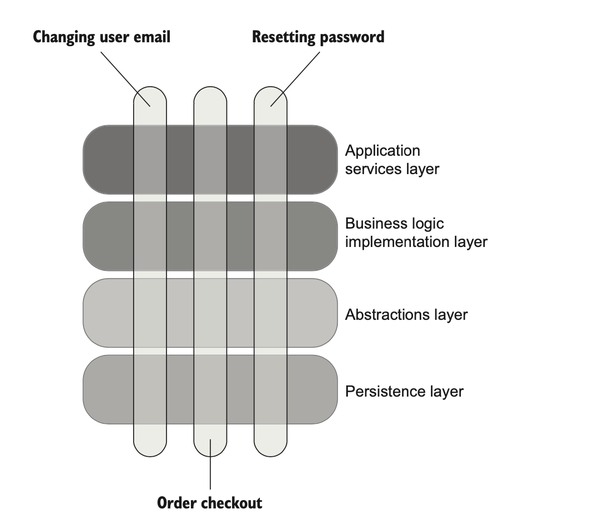

# 통합 테스트를 하는 이유 

통합 테스트를 하면 단위 테스트로는 확인하기 어려운 *'시스템이 전반적으로 잘 작동하는 지'* 를 알 수 있다. 

그리고 통합 테스트는 많은 범위를 테스트 하므로 회귀 방지가 단위 테스트 보다 좋고 테스트를 위한 협력이 필요한 협력만으로 테스트를 하니 리팩터링 내성도 좋다. 

물론 단위 테스트는 통합 테스트보다 빠르게 실행될 수 있다는 장점이 있고 격리된 상태에서 도메인 로직과 알고리즘을 테스트하기에는 적합하다.

## 어플리케이션의 모든 테스트들 

예전에 테스트의 종류 4 가지를 알아봤었는데 (간단한 테스트, 지나치게 복잡한 테스트, 컨트롤러 (서비스) 테스트, 도메인 모델과 알고리즘 테스트)

통합 테스트는 여기서 컨트롤러쪽 테스트가 되야한다. 

실제로 테스트 4 종류에서 간단한 테스트와 지나치게 복잡한 테스트는 있으면 안된다. 

단위 테스트와 통합 테스트 그리고 빠른 실패 원칙 (Fail Fast Principle) 정도면 충분하다. 

단위 테스트는 여러가지 비즈니스 시나리오를 검증하는데 사용하고 

통합 테스트는 비즈니스의 유즈 케이스와 단위 테스트로는 하지 못하는 예외 상황 (Edge case) 를 다루도록 사용한다.

그리고 통합 테스트는 모든 프로세스 외부 의존성을 사용하고 있는 플로우가 있어야 한다. (목적이 시스템의 기능 작동이 되고 있는지 확인하는 것이므로.)

만약 이러한 플로우가 없다면 모든 프로세스 외부 의존성을 다룰 수 있는 케이스만큼 작성해야 한다.

빠른 실패 원칙 (Fail Fast Principle) 같은 경우는 예상치 못한 상황을 만나면 즉시 연산을 중지하도록 예외를 던지는 걸 말한다. 

초기에 실패하도록 해서 더 큰 버그가 생기도록 막는 방식이다. 

주로 유효하지 않은 값이 넘어올 때 예외를 던지도록 하는 방법과 어플리케이션의 초기 상태를 설정 프로퍼티에서 읽어오고 유효성 검사를 한 후 적절한 상태가 아니라면 실행하지 못하도록 하는 방법이 있다. 

## 통합 테스트에서는 프로세스 외부 의존성을 모두 테스트해야 하는가? 

내가 컨트롤 할 수 있는 *관리 의존성 (데이터베이스 같은것)* 은 목으로 대체하지 않고 실제 객체를 쓰는 걸 권장한다. 

이 의존성은 변경될 가능성이 많기 때문에 목으로 대체하면 리팩터링 내성이 생기지 않을 수 있다.

내가 제어할 수 없는 *비관리 의존성 (이메일 서비스나 메시지 큐 서비스 같은 것)* 은 목으로 대체하는 걸 권장한다. 

이 부분에서 실제 객체를 쓴다면 부작용을 야기할 수 있으므로 목을 쓰는게 좋다. 

이런 의존성과의 연동에서는 주로 하위 호환성을 보장하도록 하니까 리팩터링 내성에도 강하다. 

예외로 어플리케이션에서 실제 데이터베이스를 사용할 수 없는 경우가 있다면 데이터베이스를 모킹하기 보다는 그냥 단위 테스트에 집중하는게 낫다. 

괜히 모킹하면 리팩터닝 내성이 없어져 의미없는 테스트가 된다. 

## 인터페이스의 올바른 사용에 대해서 

여기서는 많은 개발자들이 인터페이스를 잘못되게 사용하는 경우에 대해서 소개하고 어떤 환경에서 바람직한지 소개하겠다. 

많은 개발자가 다음과 같이 의존성을 연결할 때 인터페이스를 사용한다. 

````csharp
public interface IMessageBus
public class MessageBus : IMessageBus 

public interface IUserRepository 
public class UserRepository : IUserRepository 
````

이렇게 인터페이스를 사용하는 이유로는 다음 두 가지 원칙에 기반한다. 

- 의존성을 추상화 해서 느슨한 결합을 달성하기 위해서 
- 기존의 코드를 변경하지 않고 새로운 기능을 추가할 수 있는 OCP (Open-Closed Principle) 을 달성하기 위해서 

하지만 단일 구현만 있는 클래스의 경우에는 인터페이스를 사용하는 건 올바르지 않다.

이 케이스의 경우에 인터페이스를 쓴다면 그건 *YAGNI (You aren't gonna need it)* 을 위반한다. 

지금 당장 필요하지 않는데 이상한데다 시간을 쏟지말자. 

**진정한 추상화는 발명하는게 아니라 발견하는 것이다.** 

구현 객체가 두 개 이상인 경우에만 인터페이스를 쓰자.

하지만 프로세스 외부 의존성의 경우에는 단일 구현임에도 인터페이스를 쓰는데 이 이유는 하나다.

**목을 사용하기 위해서**

이 이유가 아니라면 단일 구현에서 인터페이스를 쓰지 말자.

## 통합 테스트 모범 사례 

통합 테스트를 잘 쓰기 위해서 사용되는 몇 가지 지침이 있다. 하나씩 보자. 

- 도메인 모델 경계 명시하기 

- 어플리케이션 내 계층 줄이기 

- 순환 의존성 제거하기 

### 도메인 모델 경계 명시하기 

도메인 모델을 코드베이스에서 명시적으로 격리 시켜서 단위 테스트와 통합 테스트를 구분하기 쉽도록 하자. 

단위 테스트는 도메인 모델의 비즈니스 로직과 알고리즘을 테스트 하도록 하고 

통합 테스트는 시스템의 기능 작동에 집중하도록 관심사를 나누자.

### 어플리케이션 내 계층 줄이기

엔터프라이즈급 어플리케이션에서는 계층이 여러겹인 경우가 있는데 계층 수는 필요한 계층만 있고 되도록 줄이도록 하자. 



다음과 같이 레이어가 여러개 생긴다면 단위 테스트와 통합 테스트간의 간격도 명확하지 않아진다. 

그냥 각 레이어별로 검증하도록 되고 이렇게되면 테스트가 서로 겹치는게 많아져서 테스트의 가치가 떨어진다.

가능한 필요한 계층만 두도록 하자. 

주로 **어플리케이션 서비스 계층, 도메인 계층, 인프라 계층** 이 정도면 충분하다.

인프라 계층은 도메인 모델에 속하지 않는 알고리즘과 프로세스 외부 의존성에 접근할 수 있는 코드로 구성된다.

### 순환 의존성 제거하기 

순환 의존성 (circular dependency) 는 둘 이상의 클래스가 제대로 작동하고자 할 때 서로 의존하는 것을 말한다. 

순환 의존성이 있다면 코드를 이해하기 어렵다. 주변 클래스 그래프 전체를 이해해야 하기 때문에 

그리고 동작 단위를 검증하려고 의존성을 만들 때 불편하다. 즉 테스트하기가 어렵다. 

이 경우 순환 의존성을 제거하는게 좋다.

서로가 의존하기 보다는 메시지를 받으면 처리할 수 있도록 단방향 관계가 되도록 리팩터링 하는게 좋다. 

## 로깅에 대해서 

로깅은 프로세스 외부 의존성과 연관이 있기 때문에 테스트 할 때 로깅은 목으로 대체한다. 

하지만 로깅을 남기는 앱 자체를 만들 수도 있기 때문에 이때의 로깅은 테스트가 필요하다. 주로 이러한 앱은 개발자 외의 시스템 관리자들이 어플리케이션 상태를 보기 위해서 사용한다.

로그는 어플리케이션 어디에서나 필요할 수 있지만 해당 기능과는 관련이 없기 떄문에 관심사를 분리하는게 좋다.

그리고 일반적으로 로그는 크게 두 종류가 있다. 

- 지원 로깅 (support logging): 지원 로깅은 시스템 관리자가 추적할 수 있도록 메시지를 남겨놓는 것을 말한다. 

- 진단 로깅 (diagnostic logging): 어플리케이션의 내부 상태를 파악할 수 있도록 돕는다. 주로 디버깅 용이다. 

주의할 것으로 진단 로깅은 개발용에서만 사용하고 나중에는 지워줘야 한다. 

일반적으로 로깅을 사용할 땐 목으로 대체할 수 있게 하기 위해서 Wrapper 클래스를 이용한다. 

`Logger` 를 쓰고 있다면 `DomainLogger` 로 래핑해서 사용하도록 하면 된다.

그런데 이러한 로거는 도메인 모델과 결합하면 안되므로 주로 처리하는 방식은 필요한 지원 로그를 도메인 이벤트로 만들어서 생성하고 컨트롤러 쪽에서 이 이벤트를 바탕으로 로깅을 남기도록 처리한다. 

다음과 같이. 예제는 이메일 변경에 대한 도메인 이벤트 발행이다. 

```csharp
// User Class 
public void ChangeEmail(string newEmail, Company company)
{
    _logger.Info(
        $"Changing email for user {UserId} to {newEmail}");

    Precondition.Requires(CanChangeEmail() == null);
    
    if (Email == newEmail)
        return;
    
    UserType newType = company.IsEmailCorporate(newEmail)
        ? UserType.Employee
        : UserType.Customer;
    
    if (Type != newType)
    {
        int delta = newType == UserType.Employee ? 1 : -1;
        company.ChangeNumberOfEmployees(delta);
    }
    
    AddDomainEvent(
        new UserTypeChangedEvent(
            UserId, Type, newType)); // Uses a domain event instead of DomainLogger
    
    Email = newEmail;
    Type = newType;
    AddDomainEvent(new EmailChangedEvent(UserId, newEmail));
    _logger.Info($"Email is changed for user {UserId}");
}
```

```csharp
// User Controller 
public string ChangeEmail(int userId, string newEmail)
{
    object[] userData = _database.GetUserById(userId);
    User user = UserFactory.Create(userData);

    string error = user.CanChangeEmail();
    if (error != null)
        return error;
    
    object[] companyData = _database.GetCompany();
    Company company = CompanyFactory.Create(companyData);
    
    user.ChangeEmail(newEmail, company);
    
    _database.SaveCompany(company);
    _database.SaveUser(user);
    _eventDispatcher.Dispatch(user.DomainEvents); // Dispatches user domain events
    return "OK";
}
```

마지막으로 로거 인스턴스를 의존성으로 전달할 때는 명시적 의존성을 사용하도록 하자. 

정적 필드와 정적 메소드를 통해서 로그를 사용하는 경우가 있는데 이는 의존성을 변경하기 어렵다는 단점이 있다.

즉 모킹을 사용하기 어려워서 테스트 하기도 어렵다.  

